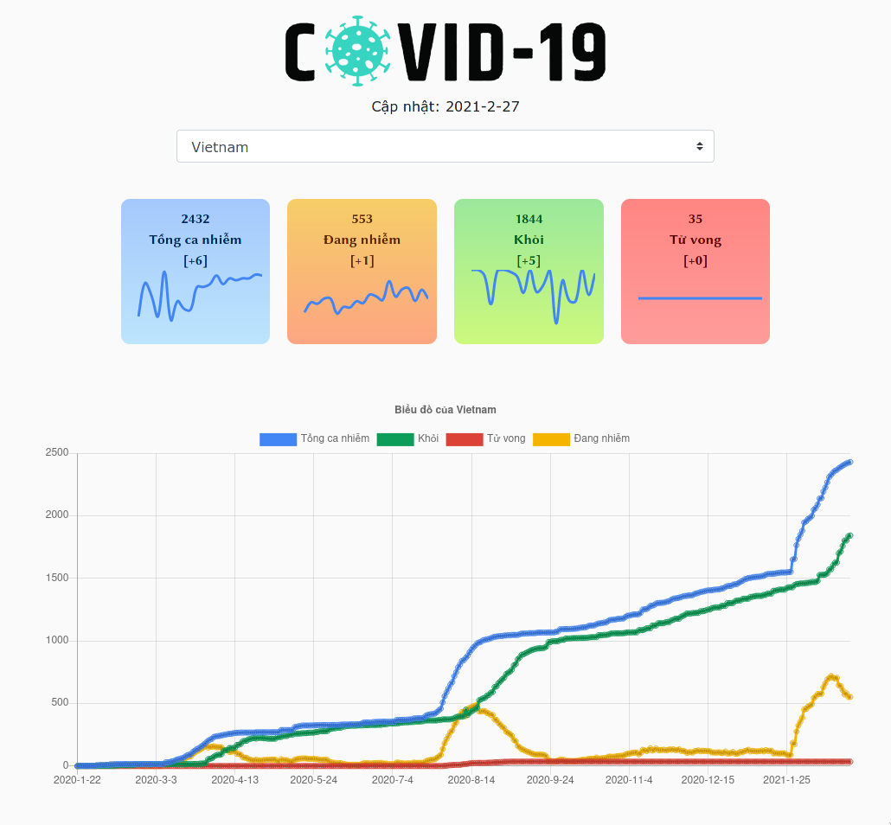
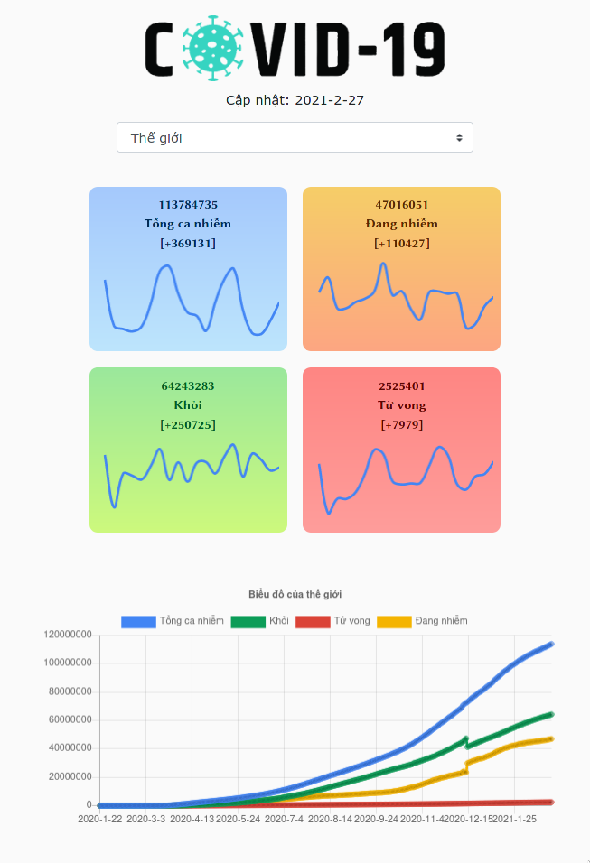

# Trang web theo dõi dịch Covid-19 làm bằng React Typescript, React Hooks và React Bootstrap và React ChartJS, hỗ trợ:

- Xem tổng số ca nhiễm, đang nhiễm, hồi phục và tử vong (và từng biểu đồ của chúng trong 20 ngày gần nhất giúp người dùng đánh giá được sự tăng giảm đúng nhất) của từng nước và toàn thế giới.
- Biểu đồ tổng quát của từng nước và toàn thế giới từ lúc xuất hiện ca nhiễm đầu tiên đến thời điểm cập nhật gần nhất.
- Hỗ trợ tốt animation và responsive.

### Ảnh chụp màn hình

